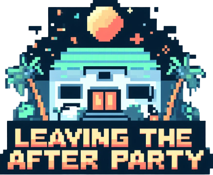

# Leaving The After Party
 

This project marks the completion of a web application development course. It's a Unity and C# video game, playable online via WebGL. It showcases a fusion of game design and programming skills in a practical setting.

> ⚠️ **STILL IN DEVELOPMENT** ⚠️  
> This project is still under development. We're working hard to release the first version of LeavingTheAfterparty as soon as possible.

    

## 🛠️ Build With 
- [Unity](https://docs.unity.com/) - Game graphics engine.
- [C#](https://learn.microsoft.com/en-us/dotnet/csharp/) - Unity programming language.
- [PHP](https://www.php.net/docs.php) - Web scripting language.
- [MySQL](https://dev.mysql.com/doc/) - Web database.

## 🙏🏻 Contributing 
This project exists thanks to all people who contribute.

## 📄 License 
This project is licensed under the [Apache License 2.0](./LICENSE)
